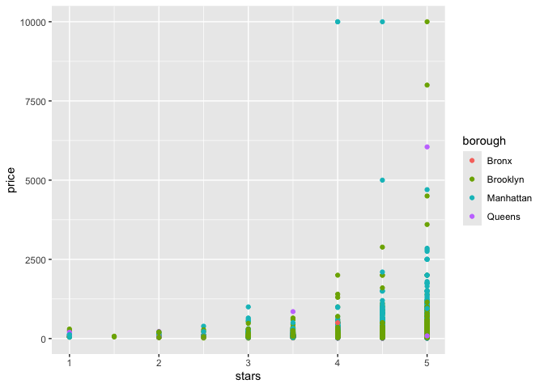
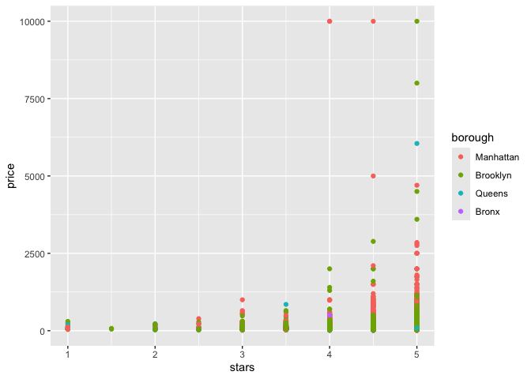
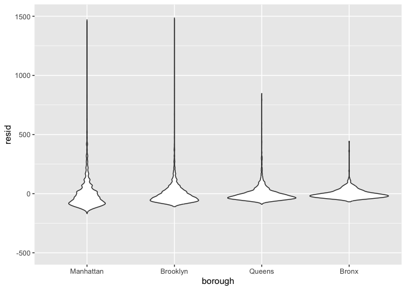

linear_models
================
Nelson Gaillard
2025-11-30

``` r
library(tidyverse)
```

    ## ── Attaching core tidyverse packages ──────────────────────── tidyverse 2.0.0 ──
    ## ✔ dplyr     1.1.4     ✔ readr     2.1.5
    ## ✔ forcats   1.0.0     ✔ stringr   1.5.1
    ## ✔ ggplot2   3.5.2     ✔ tibble    3.3.0
    ## ✔ lubridate 1.9.4     ✔ tidyr     1.3.1
    ## ✔ purrr     1.1.0     
    ## ── Conflicts ────────────────────────────────────────── tidyverse_conflicts() ──
    ## ✖ dplyr::filter() masks stats::filter()
    ## ✖ dplyr::lag()    masks stats::lag()
    ## ℹ Use the conflicted package (<http://conflicted.r-lib.org/>) to force all conflicts to become errors

``` r
library(p8105.datasets)
```

# Linear Regression

## Import data

``` r
data("nyc_airbnb")

nyc_airbnb =
  nyc_airbnb |> 
  mutate(stars = review_scores_location / 2) |> 
  rename(
    borough = neighbourhood_group,
    neighborhood = neighbourhood) |> 
  filter(borough != "Staten Island") |> 
  select(price, stars, borough, neighborhood, room_type)
```

## Fit a model

``` r
nyc_airbnb |> 
  ggplot(aes(x = stars, y = price, color = borough)) +
  geom_point()
```

    ## Warning: Removed 9962 rows containing missing values or values outside the scale range
    ## (`geom_point()`).

<!-- -->

Let’s fit the model we care about.

``` r
fit = lm(price ~ stars + borough, data = nyc_airbnb)
```

Let’s look at the result…

Let’s look at the result better…

``` r
broom::glance(fit)
```

    ## # A tibble: 1 × 12
    ##   r.squared adj.r.squared sigma statistic   p.value    df   logLik    AIC    BIC
    ##       <dbl>         <dbl> <dbl>     <dbl>     <dbl> <dbl>    <dbl>  <dbl>  <dbl>
    ## 1    0.0342        0.0341  182.      271. 6.73e-229     4 -202113. 4.04e5 4.04e5
    ## # ℹ 3 more variables: deviance <dbl>, df.residual <int>, nobs <int>

``` r
broom::tidy(fit) |> 
  select(-std.error, -statistic) |> 
  mutate(
    term = str_replace(term, "borough", "Borough: ")
  ) |> 
  knitr::kable()
```

| term               |  estimate |   p.value |
|:-------------------|----------:|----------:|
| (Intercept)        | -70.41446 | 0.0000005 |
| stars              |  31.98989 | 0.0000000 |
| Borough: Brooklyn  |  40.50030 | 0.0000022 |
| Borough: Manhattan |  90.25393 | 0.0000000 |
| Borough: Queens    |  13.20617 | 0.1451682 |

## Be in control of factors

``` r
nyc_airbnb =
  nyc_airbnb |> 
  mutate(
    borough = fct_infreq(borough),
    room_type = fct_infreq(room_type)
  )
```

Look at that plot again

``` r
nyc_airbnb |> 
  ggplot(aes(x = stars, y = price, color = borough)) +
  geom_point()
```

    ## Warning: Removed 9962 rows containing missing values or values outside the scale range
    ## (`geom_point()`).

<!-- -->

``` r
fit = lm(price ~ stars +borough, data = nyc_airbnb)

broom::tidy(fit)
```

    ## # A tibble: 5 × 5
    ##   term            estimate std.error statistic   p.value
    ##   <chr>              <dbl>     <dbl>     <dbl>     <dbl>
    ## 1 (Intercept)         19.8     12.2       1.63 1.04e-  1
    ## 2 stars               32.0      2.53     12.7  1.27e- 36
    ## 3 boroughBrooklyn    -49.8      2.23    -22.3  6.32e-109
    ## 4 boroughQueens      -77.0      3.73    -20.7  2.58e- 94
    ## 5 boroughBronx       -90.3      8.57    -10.5  6.64e- 26

``` r
broom::glance(fit)
```

    ## # A tibble: 1 × 12
    ##   r.squared adj.r.squared sigma statistic   p.value    df   logLik    AIC    BIC
    ##       <dbl>         <dbl> <dbl>     <dbl>     <dbl> <dbl>    <dbl>  <dbl>  <dbl>
    ## 1    0.0342        0.0341  182.      271. 6.73e-229     4 -202113. 4.04e5 4.04e5
    ## # ℹ 3 more variables: deviance <dbl>, df.residual <int>, nobs <int>

## Diagnostics

``` r
modelr::add_residuals(nyc_airbnb, fit) |> 
  ggplot(aes(x = borough, y = resid)) +
  geom_violin() +
  ylim(-500, 1500)
```

    ## Warning: Removed 9993 rows containing non-finite outside the scale range
    ## (`stat_ydensity()`).

<!-- -->

``` r
nyc_airbnb |> 
  modelr::add_residuals(fit) |> 
  ggplot(aes(x = stars, y = resid)) +
  geom_point() +
  facet_wrap(. ~ borough)
```

    ## Warning: Removed 9962 rows containing missing values or values outside the scale range
    ## (`geom_point()`).

<!-- -->

## Hypothesis tests

This does t-test by default

``` r
fit |> 
  broom::tidy()
```

    ## # A tibble: 5 × 5
    ##   term            estimate std.error statistic   p.value
    ##   <chr>              <dbl>     <dbl>     <dbl>     <dbl>
    ## 1 (Intercept)         19.8     12.2       1.63 1.04e-  1
    ## 2 stars               32.0      2.53     12.7  1.27e- 36
    ## 3 boroughBrooklyn    -49.8      2.23    -22.3  6.32e-109
    ## 4 boroughQueens      -77.0      3.73    -20.7  2.58e- 94
    ## 5 boroughBronx       -90.3      8.57    -10.5  6.64e- 26

What about the significance of `borough`

``` r
fit_null = lm(price ~ stars, data = nyc_airbnb)
fit_alt = lm(price ~ stars + borough, data = nyc_airbnb)

anova(fit_null, fit_alt) |> 
  broom::tidy()
```

    ## # A tibble: 2 × 7
    ##   term                    df.residual     rss    df   sumsq statistic    p.value
    ##   <chr>                         <dbl>   <dbl> <dbl>   <dbl>     <dbl>      <dbl>
    ## 1 price ~ stars                 30528  1.03e9    NA NA            NA  NA        
    ## 2 price ~ stars + borough       30525  1.01e9     3  2.53e7      256.  7.84e-164
